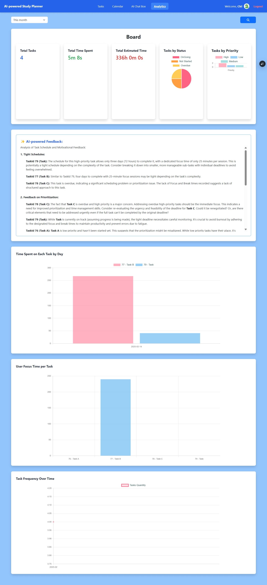

# AI-Powered Study Planner

## Table of Contents

- [Overview](#overview)
- [Project Overview](#project-overview)
- [Features](#features)
- [Project Structure](#project-structure)
- [Technologies Used](#technologies-used)
- [Installation](#installation)
- [ESLint Configuration](#eslint-configuration)
- [Interfaces](#interfaces)

## Overview

This project is an **AI-powered study planner** built with **React, TypeScript, and Vite**. It provides a minimal setup to get React working in Vite with HMR and ESLint rules.

## Project Overview

The AI-powered study planner helps users manage their study schedules efficiently. It includes features like task management, analytics, and user authentication.

## Features

- **Task Management** – Create, update, and delete tasks.
- **Task Scheduling** – Drag-and-drop tasks on a calendar to update their status.
- **Pomodoro Timer** – Helps users stay focused with structured study sessions.
- **AI-powered Feedback** – Uses **Gemini API** to optimize study schedules.
- **Analytics** – Visualize task data with charts.
- **Password Reset** – Secure password recovery via email reset links.
- **Real-time Synchronization** – Uses **Ably WebSocket** for seamless task updates.
- **Responsive Design** – Optimized for both desktop and mobile devices.

---

## Project Structure

The project structure is organized as follows:

```
FE-AI-powered-Study-Planner/
├── public/            # Static assets
├── src/               # Source code
│   ├── components/    # Reusable components
|   ├── context/       # Manages global state using React Context API.
│   ├── hooks/         # Custom hooks
|   ├── modals/        # Contains modal components
│   ├── pages/         # Page components
|   ├── types/         # TypeScript type definitions.
│   ├── utils/         # Utility functions
│   ├── App.tsx        # Main App component
│   ├── index.tsx      # Entry point
│   └── ...            # Other files
├── eslint.config.js       # ESLint configuration
├── package.json       # Project dependencies and scripts
├── tsconfig.json      # TypeScript configuration
└── vite.config.ts     # Vite configuration
```

---

## Technologies Used

| Technology       | Purpose                                 |
| ---------------- | --------------------------------------- |
| **React**        | Frontend framework                      |
| **TypeScript**   | Enhances JavaScript with static typing  |
| **Vite**         | Fast build tool and development server  |
| **Tailwind CSS** | Utility-first CSS framework for styling |
| **Chart.js**     | Data visualization (charts and graphs)  |
| **Axios**        | HTTP client for API calls               |
| **Moment.js**    | Date and time manipulation              |
| **Ably**         | Real-time WebSocket synchronization     |
| **Gemini API**   | AI-powered feedback and optimization    |

---

## Installation

To install and run the project locally, follow these steps:

### 1. Clone the repository

```bash
git clone https://github.com/lpchi133/FE-AI-powered-Study-Planner.git
cd FE-AI-powered-Study-Planner
```

### 2. Install dependencies

```bash
npm install
```

### 3. **Set up environment variables:**

Create a `.env` file and configure the following variables:

```env
VITE_ENDPOINT_URL=<LINK_BACKEND>
GEMINI_API_KEY=<YOUR_GEMINI_API_KEY>
VITE_ABLY_API_KEY=<YOUR_ABLY_API_KEY>
```

### 4. Start the development server

```bash
npm run dev
```

After running the server, the application will be available at [http://localhost:5173](http://localhost:5173).

**Note:** The backend must be running for the features to work properly. The backend can be found at the following link: [Backend Repository](https://github.com/lpchi133/BE-AI-powered-Study-Planner)

---

## ESLint Configuration

This project uses **ESLint** for code linting. Currently, two official plugins are available:

- **@vitejs/plugin-react** – Uses Babel for Fast Refresh.
- **@vitejs/plugin-react-swc** – Uses SWC for Fast Refresh.

### Expanding ESLint Configuration

For stricter linting in production, update `eslint.config.js`:

```js
export default tseslint.config({
  languageOptions: {
    parserOptions: {
      project: ["./tsconfig.node.json", "./tsconfig.app.json"],
      tsconfigRootDir: import.meta.dirname,
    },
  },
});
```

To enforce React best practices, install `eslint-plugin-react`:

```bash
npm install eslint-plugin-react --save-dev
```

Then, update your ESLint config:

```js
import react from "eslint-plugin-react";

export default tseslint.config({
  settings: {
    react: { version: "18.3" },
  },
  plugins: { react },
  rules: {
    ...react.configs.recommended.rules,
    ...react.configs["jsx-runtime"].rules,
  },
});
```

---

## Interfaces

- Login page
  

- Homepage
  

- Add Task
  

- Calendar
  

- AI Suggestion
  

- Pomodoro Timer
  

- Analytics
  
